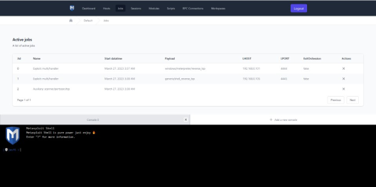

<h1 align="center">Metasploit GUI</h1>
<p align="center">

</p>
<p align="center">
	  <em>The graphical interface for controling Metasploit framework</em>
</p>

## Table of Contents
* [About Metasploit GUI](#about-metasploit-gui)
* [Tech Stack](#tech-stack)
* [Prerequisites](#prerequisites)
* [Development setup](#development-setup)
* [Features](#features)
* [Screenshots](#screenshots)
* [License](#license)

## About Metasploit GUI

The graphical interface for controling Metasploit framework via krzychu12350/metasploit package that autogenerated API to communication with any Metasploit RPC Server for Laravel framework.


Link to krzychu12350/metasploit package: https://packagist.org/packages/krzychu12350/metasploitapi
## Tech Stack
 

## Prerequisites
1. Node.js 18.12.1 minimum
2. Laravel 9.19 minimum with installed krzychu12350/metasploitapi package https://packagist.org/packages/krzychu12350/metasploitapi

## Development setup
1. Install dependencies

```bash
  npm install
```

2. Start the Vite server

```bash
  npm run dev
```

3. Open a browser and type in address bar

```bash
  http://localhost:5173/
```

## Features
- connect with a Metasploit RPC server
- use Metasploit modules and the Nmap tool,
- manage hosts,
- save hosts from a workspace into a file and read from a file,
- manage active tasks,
- search, browse and run Metasploit framework modules,
- manage and run automation scripts,
- manage and switch beetwen workspaces,
- manage and switch between RPC connections,
- manage and interact with a session,
- manage and use consoles.

## Screenshots


<p align="center">
    
</p>
<p align="center">
	  <em>Login view (connecting to the RPC server)</em>
</p>


<p align="center">
    
</p>
<p align="center">
	  <em>Dashboard view</em>
</p>

<p align="center">
    
</p>
<p align="center">
	  <em>Hosts management view</em>
</p>

<p align="center">
    
</p>
<p align="center">
	  <em>Active jobs management view</em>
</p>

<p align="center">
    
</p>
<p align="center">
	  <em>Active sessions management view</em>
</p>

<p align="center">
    
</p>
<p align="center">
	  <em>Modules view</em>
</p>

<p align="center">
    
</p>
<p align="center">
	  <em>Script management view</em>
</p>

<p align="center">
    
</p>
<p align="center">
	  <em>RPC connections management view</em>
</p>

<p align="center">
    
</p>
<p align="center">
	  <em>Workspaces management view</em>
</p>

<p align="center">
    
</p>
<p align="center">
	  <em>Meterpreter sessions interaction view</em>
</p>

## License
All Rights Reserved

Copyright (c) 2022 Krzysztof Karaś

Created by Krzysztof Karaś
